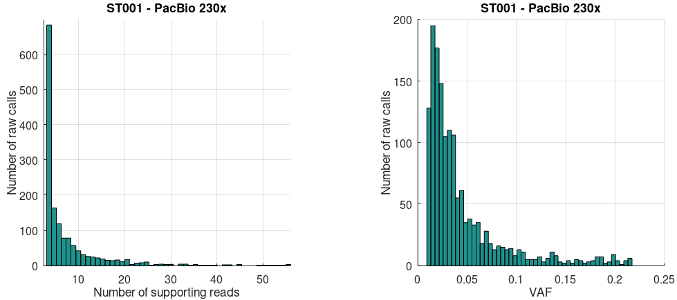
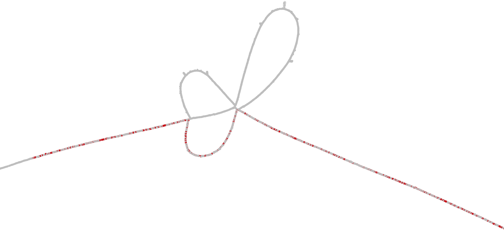
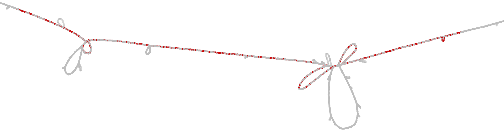
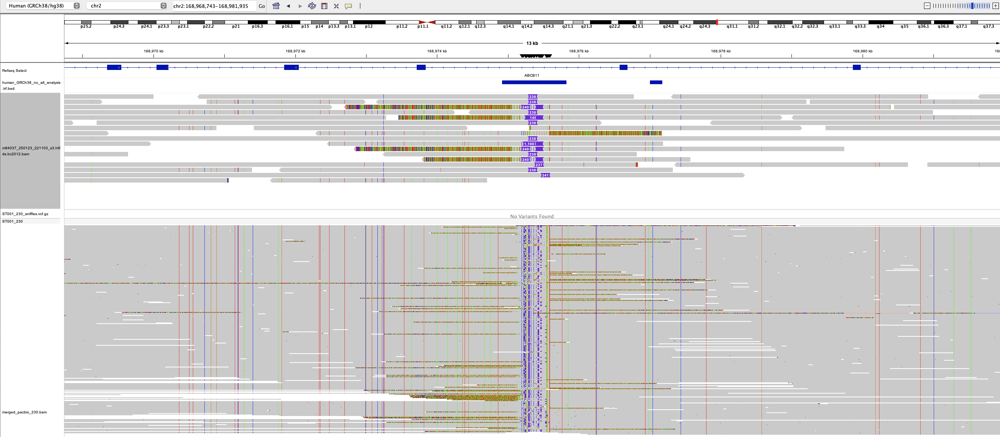
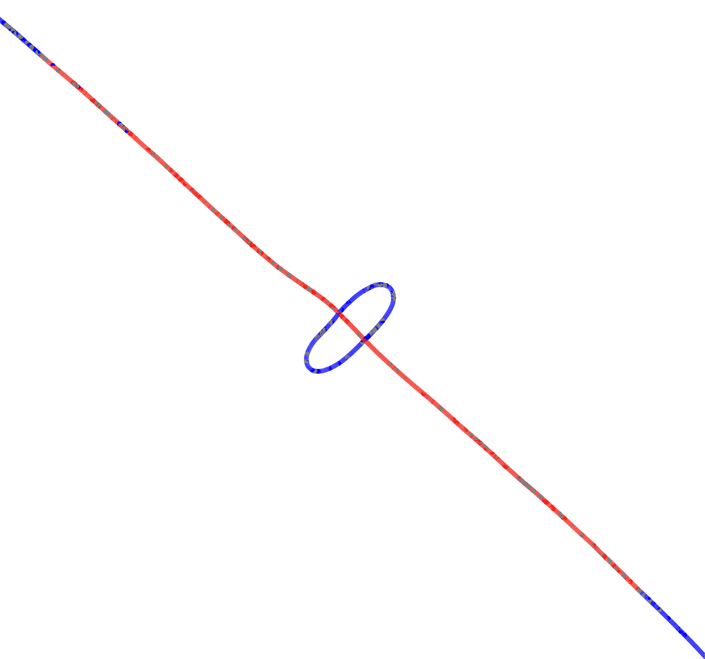
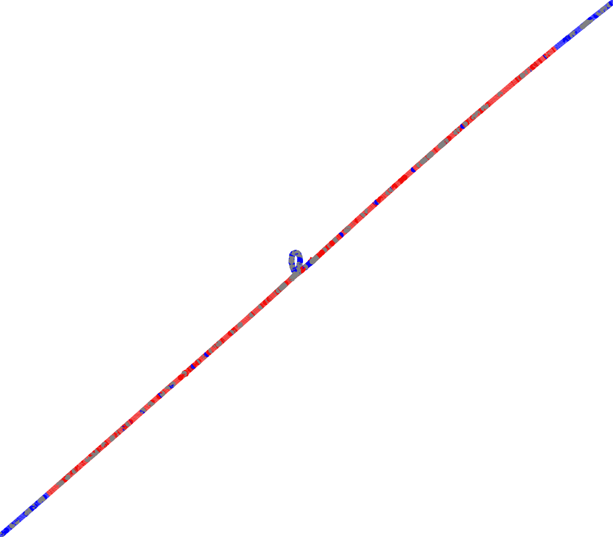

# Effect of coverage on somatic SV calling

[Metadata of all SMaHT samples](https://docs.google.com/spreadsheets/d/11T_QpVq4XEfupEeGD9IW5oVt1our6u3KzEtP6LBEc5w/edit?usp=sharing) at the time of this study.

# Liver, long reads.

We consider the following input:

* `ST001`: healthy liver sample, sequenced at ~230x with PacBio Revio (this includes a ~26x Fiber-seq BAM) and at ~210x with ONT PromethION 24 (coverages estimated from chr1). Data downloaded from [the benchmarking section of the data portal](https://data.smaht.org/data/benchmarking/donor-st001#liver).
* `SMHT001`: death caused by liver failure, alcohol abuse as a death circumstance. Sequenced at ~10x with PacBio Revio. Data downloaded from workspace [SMaHT_Short_Read_Long_Read_Analysis](https://app.terra.bio/#workspaces/smaht-gcc-short-read/SMaHT_Short_Read_Long_Read_Analysis/data), table `SMAHT001_collaborator_long_read`, field `sample_collaborator_id=SMHT001-3I-001A2`.

For each ST001 technology, we merge all the BAMs, we take random samples at multiples of 10x, and on every such subsample we run [`sniffles --mosaic`](https://github.com/fritzsedlazeck/Sniffles#c-mosaic-sv-calling-non-germline-or-somatic-svs) **requiring just two reads** to support a call (i.e. we set `--mosaic-af-min` as a function of coverage). We only output calls that Sniffles considers as somatic, i.e. that have `--mosaic-af-max=0.218` (the default). Each call is annotated with the IDs of the reads that support it. We only consider calls in the standard chromosomes.


Circles: 10x SMHT001 (liver failure). In the 230x ST001 VCF, TR calls do not seem to be enriched in specific TR intervals (according to `bedtools intersect -c`).


Running sniffles with a constant min allele frequency (`--mosaic-af-min 0.05`, the default) shows a peak at 100x instead:


Calls from the BAM with max coverage:





## ST001 PacBio (healthy)
Examples of calls of length >6k in the 230x VCF:


## SMHT001 PacBio (liver failure)
There are only 14 total calls, all of which except one occur in a TR. 

### Potential candidates


### Calls unlikely to be somatic


### Calls near complex events


# Liver, short reads.

We consider the following input:

* `ST001`: healthy liver sample, sequenced at ~122x with Illumina NovaSeq X. Data downloaded from [the benchmarking section of the data portal](https://data.smaht.org/data/benchmarking/donor-st001#liver), file accession [SMAFILE7Y4Y9](https://data.smaht.org/output-files/b784cb52-f497-4113-b341-813ee0e6d700/).
* `SMHT001`: cirrotic liver sample sequenced at ~124x with Illumina NovaSeq X. Data downloaded from workspace [SMaHT_Benchmarking_Short_Read](https://app.terra.bio/#workspaces/smaht-gcc-short-read/SMaHT_Benchmarking_Short_Read/data), table `SMAHT001_collaborator_short_read`, field `SMAHT001_collaborator_short_read_id=SM-OLQZF`, fields `collaborator_sample_id=SMHT001-3I-001A1`.

Many short-read somatic callers work in a tumor-normal setting, so we select the following data as "normal":

* `ST001`: a skin sample sequenced at ~100x with Illumina NovaSeq X. Data downloaded from [the benchmarking section of the data portal](https://data.smaht.org/data/benchmarking/donor-st001#skin), file accession [SMAFINU18SZV](https://data.smaht.org/output-files/40ba2ef7-0de0-44d9-992a-189731059bb0/).
* `SMHT001`: a skin sample sequenced at ~90x with Illumina NovaSeq X. Data downloaded from workspace [SMaHT_Benchmarking_Short_Read](https://app.terra.bio/#workspaces/smaht-gcc-short-read/SMaHT_Benchmarking_Short_Read/data), table `SMAHT001_collaborator_short_read`, field `SMAHT001_collaborator_short_read_id=SM-OLRTD`, fields `collaborator_sample_id=SMHT001-3AF-001A2`.

We run [Manta](https://github.com/Illumina/manta?tab=readme-ov-file) in tumor-normal  somatic mode (Manta has also a tumor-only mode, but it is [experimental](https://github.com/Illumina/manta/blob/master/docs/userGuide/README.md#introduction)). For `ST001` (healthy) we get 134 calls, 120 of which are BNDs. Example:
```
chr1    10012296        MantaBND:1200:0:0:0:0:0:0       G       [chr1:10012368[G        .       MinSomaticScore SVTYPE=BND;MATEID=MantaBND:1200:0:0:0:0:0:1;CIPOS=0,3;HOMLEN=3;HOMSEQ=CTT;SOMATIC;SOMATICSCORE=25;BND_DEPTH=83;MATE_BND_DEPTH=85  PR:SR   58,0:88,0       63,2:115,2
chr1    10012365        MantaBND:1200:0:0:0:0:0:1       A       [chr1:10012299[A        .       MinSomaticScore SVTYPE=BND;MATEID=MantaBND:1200:0:0:0:0:0:0;CIPOS=0,3;HOMLEN=3;HOMSEQ=GCA;SOMATIC;SOMATICSCORE=25;BND_DEPTH=85;MATE_BND_DEPTH=83  PR:SR   58,0:88,0       63,2:115,2
chr1    16035669        MantaDEL:0:3498:3499:0:0:0      G       <DEL>   .       MinSomaticScore END=16058763;SVTYPE=DEL;SVLEN=-23094;IMPRECISE;CIPOS=-135,136;CIEND=-115,115;SOMATIC;SOMATICSCORE=25    PR      140,1   136,8
chr1    17868650        MantaBND:0:3926:3929:0:0:0:0    A       [chr11:68505958[A       .       MinSomaticScore SVTYPE=BND;MATEID=MantaBND:0:3926:3929:0:0:0:1;IMPRECISE;CIPOS=-295,295;SOMATIC;SOMATICSCORE=21;BND_DEPTH=90;MATE_BND_DEPTH=119   PR      105,1   96,9
chr1    21981417        MantaDUP:TANDEM:2443:0:2:0:0:0  C       <DUP:TANDEM>    .       MinSomaticScore END=22006096;SVTYPE=DUP;SVLEN=24679;IMPRECISE;CIPOS=-205,205;CIEND=-152,152;SOMATIC;SOMATICSCORE=10     PR      166,2   135,7
chr1    28377206        MantaBND:3449:0:1:0:0:0:1       A       A]chr1:28377946]        .       MinSomaticScore SVTYPE=BND;MATEID=MantaBND:3449:0:1:0:0:0:0;CIPOS=0,18;HOMLEN=18;HOMSEQ=GGATTACAGGCGTGAGCC;SOMATIC;SOMATICSCORE=16;BND_DEPTH=92;MATE_BND_DEPTH=89 PR:SR   101,0:114,0     109,1:139,3
chr1    28377928        MantaBND:3449:0:1:0:0:0:0       T       T]chr1:28377224]        .       MinSomaticScore SVTYPE=BND;MATEID=MantaBND:3449:0:1:0:0:0:1;CIPOS=0,18;HOMLEN=18;HOMSEQ=GGCTCACGCCTGTAATCC;SOMATIC;SOMATICSCORE=16;BND_DEPTH=89;MATE_BND_DEPTH=92 PR:SR   101,0:114,0     109,1:139,3
```

For `SMHT001` (cirrotic) we get 32 calls, 26 of which are BNDs. Example:
```
chr1    90378706        MantaBND:8990:0:1:0:0:0:0       T       T]chr7:134929711]       .       MinSomaticScore SVTYPE=BND;MATEID=MantaBND:8990:0:1:0:0:0:1;IMPRECISE;CIPOS=-128,128;SOMATIC;SOMATICSCORE=16;BND_DEPTH=12;MATE_BND_DEPTH=53       PR      17,0    28,5
chr2    91518954        MantaDEL:30438:1:1:0:1:0        CTGGCTGCCTGGCTGGCTGTTTGGCTTGGCTGGCTTGGCTGGCTGGGTGGCTTGGCTGGTTTGGCTAGCTGGCTGGCTGGGTAGCTTGGCTAGCTGGCTGGCTTGGCTGGTTGGCTGGCTTGGCTGGCTTGGCTAGCCGGCTGGCTTAGTTGGCTGGATGGCTTGGCTGGCATGCCTGGCT     C       .       MaxMQ0Frac;MinSomaticScore      END=91519134;SVTYPE=DEL;SVLEN=-180;CIGAR=1M180D;CIPOS=0,6;HOMLEN=6;HOMSEQ=TGGCTG;SOMATIC;SOMATICSCORE=14        PR:SR   19,0:58,0       38,0:83,8
chr2    94646936        MantaBND:30805:0:3:0:0:0:0      C       C[chr6:9285873[ .       MinSomaticScore SVTYPE=BND;MATEID=MantaBND:30805:0:3:0:0:0:1;IMPRECISE;CIPOS=-160,161;SOMATIC;SOMATICSCORE=21;BND_DEPTH=72;MATE_BND_DEPTH=41    PR        37,1    32,8
chr4    20885473        MantaBND:62961:0:2:0:0:0:1      G       G]chr5:58943836]        .       PASS    SVTYPE=BND;MATEID=MantaBND:62961:0:2:0:0:0:0;IMPRECISE;CIPOS=-85,85;SOMATIC;SOMATICSCORE=56;BND_DEPTH=103;MATE_BND_DEPTH=113    PR        119,0   107,9
chr4    63202121        MantaDEL:66559:0:0:0:4:0        TATATAGGATATATAGTATATATATAATATATATAGGATATATAGTATATATATAATATAGGATATATAGTATATTTACACTATATATAATGTCTAATAGGATATATAGTATATATATA T       .       MinSomaticScore END=63202239;SVTYPE=DEL;SVLEN=-118;CIGAR=1M118D;CIPOS=0,30;HOMLEN=30;HOMSEQ=ATATAGGATATATAGTATATATATAATATA;SOMATIC;SOMATICSCORE=10        PR:SR   4,0:20,4        7,0:18,5
chr5    58943836        MantaBND:62961:0:2:0:0:0:0      T       T]chr4:20885473]        .       PASS    SVTYPE=BND;MATEID=MantaBND:62961:0:2:0:0:0:1;IMPRECISE;CIPOS=-93,94;SOMATIC;SOMATICSCORE=56;BND_DEPTH=113;MATE_BND_DEPTH=103    PR        119,0   107,9
chr5    77395471        MantaBND:84650:0:4:1:0:0:1      C       C]chr12:95432519]       .       PASS    SVTYPE=BND;MATEID=MantaBND:84650:0:4:1:0:0:0;IMPRECISE;CIPOS=-81,81;SOMATIC;SOMATICSCORE=35;BND_DEPTH=106;MATE_BND_DEPTH=104    PR        100,0   70,7
```

<!--
Other SV callers we should try:
* [GRIDSS](https://github.com/PapenfussLab/gridss?tab=readme-ov-file) in single-sample mode. This is unlikely to outputs somatic calls, since the [readme suggests](https://github.com/PapenfussLab/gridss?tab=readme-ov-file#how-do-i-perform-tumournormal-somatic-variant-calling) to jointly call on all samples from a patient. We should also run `gridss_somatic_filter` at the end, but this seems to [require](https://github.com/PapenfussLab/gridss?tab=readme-ov-file#how-do-i-create-the-panel-of-normals-required-by-gridss_somatic_filter) a panel of normals since it still assumes a tumor/normal setting. 

Delly seems to [require](https://github.com/dellytools/delly#somatic-sv-calling) matched tumor/normal samples, so we don't run it.
-->


## SMHT001 (liver failure)

We IGV'd each one of the top 50 expressed genes in the liver according to [GTEx](https://www.gtexportal.org/home/tissue/Liver), but by eye we could only find intronic SVs in C1R and HPD that are germline (we checked other tissues from the same donor and they appear there as well).


# Tandem repeat analysis

We IGV'd (in the ST001 230x PacBio BAM) each one of the top 50 expressed genes in the liver according to [GTEx](https://www.gtexportal.org/home/tissue/Liver), and we saw multiple haplotypes in some TRs:


## Long vs short reads in TRs

It is well known that PacBio reads (top) can capture the structure of TRs better than Illumina reads (bottom). Examples with candidate somatic variation from ST001 230x PacBio:


PacBio reads can also show the 5mC status of TRs (examples from ST001 230x PacBio):


## Detailed analysis of some TR regions

In the ST001 230x PacBio BAM.

**Note on clipped alignments.** In this PacBio sample, ~3% of all reads have at least one clipped alignment, defined as an alignment with either a 100bp left or a 100bp right soft clip and that involves a canonical chromosome. Often these reads map to more than one chromosome, or contain sequence that does not map to any region of GRCh38. We assume that such reads are chimeras and discard them, unless their clips are aligned and their patterns of mismatching bases are supported by more than one read. The same phenomenon occurs in PacBio samples from HPRC, and in ONT reads from ST001.


### chr4:99305502-99305645


We extract spanning reads from the ST001 230x PacBio BAM with hapestry's command:
```
extract_reads_from_windows --output_dir ./reads_with_q/ \
	--bam_csv ${SAMPLES_LIST} \
	--windows ${FLANKED_WINDOWS_BED} \
	--bam_not_hardclipped \
	--require_spanning \
	--flank_length 0 \
	--fetch_max_length 100000 \
	--get_qualities \
	--tags NM \
	--n_threads 1 \
	--force_forward
```
Then, we load the FASTA into Jalview and use MAFFT with preset FFT-NS-1 (Speed oriented). Note that a multiple sequence alignment automatically hides all germline homs, and puts all the germline hets in the same cluster.


This TR has no 5mC marks.


### chr1:16563818-16567204


This TR seems to be methylated, and to have >=2 distinct 5mC patterns (gray: FWD strand, green: REV strand):


Zooming in, several clipped alignments seem to have mismatching bases aligned with a hom INS, and the patterns of mismatch seem to be supported by more than one read. These may just be the beginning/end of the same hom INS, but it is worth investigating.


We extract all alignments (spanning and non-spanning) with the "Export alignments" feature of IGV. Then, we build a POA graph using abPOA with flags `--amb-strand --sort-by-len --result 3` (the TR sequence in the reference is in red):


<!--  -->


### chr19:3971709-3975587

The ends of clipped alignments seem to be consistently located, and the mismatching bases seem to be supported by more than one read:


Moreover, this TR seems to be methylated with a consistent pattern, which seems to diverge in the clipped alignments (gray: FWD strand, green: REV strand):


We extract all alignments (spanning and non-spanning) with the "Export alignments" feature of IGV. Then, we build a POA graph using abPOA with flags `--amb-strand --sort-by-len --result 3` (the TR sequence in the reference is in red):


<!--  -->


### chr19:3988584-3990151

Several clipped alignments seem to have mismatching bases aligned with a het INS, and the patterns of mismatch seem to be supported by more than one read. These may just be the beginning/end of the same het INS, but it is worth investigating.


Moreover, this TR seems to be methylated with a consistent pattern, which seems to diverge in the clipped alignments (gray: FWD strand, green: REV strand):


We extract all alignments (spanning and non-spanning) with the "Export alignments" feature of IGV. Then, we build a POA graph using abPOA with flags `--amb-strand --sort-by-len --result 3` (the TR sequence in the reference is in red):


<!--  -->


<!--
## Characterizing reads with clipped alignments

In the ST001 230x PacBio sample, 3.1% of all reads (i.e. 1'331'049 of 42'912'521 total) have at least one clipped alignment, defined as an alignment with either a 100bp left or a 100bp right soft clip and that involves a canonical chromosome (see [ClippedAlignments.java](https://github.com/fabio-cunial/smaht_experiments/blob/main/scripts/ClippedAlignments.java)). Here are some reads with clipped alignments, where colors corresponds to chromosomes in forward (positive) and reverse-complement (negative) orientation, and where:

* 0 = no alignment
* 23 = chrX
* 24 = chrY
* 25 = chrM
* 30 = non-canonical


Many reads map to just one chromosome and then continue with sequence that is not mapped to any region of GRCh38, and many reads map to at least one non-canonical GRCh38 chromosome:


The 230x PacBio BAM was created by merging the following 6 files provided in [the benchmarking section of the data portal](https://data.smaht.org/data/benchmarking/donor-st001#liver) and generated by different sequencing centers (an asterisk identifies Fiber-seq samples):

```
* ST001-1A-003S3-M22-B004-uwsc-SMAFIAK7UKIU-pbmm2_1.13.0_GRCh38.aligned.sorted.bam
  ST001-1A-XX-M22-B001-bcm-SMAFI1DZ62NM-pbmm2_1.13.0_GRCh38.aligned.sorted.bam
  ST001-1A-XX-M22-B001-bcm-SMAFI9VER4C3-pbmm2_1.13.0_GRCh38.aligned.sorted.bam
  ST001-1A-XX-M22-B001-bcm-SMAFIYT6BC6F-pbmm2_1.13.0_GRCh38.aligned.sorted.bam
  ST001-1A-XX-M22-B001-broad-SMAFIFXDVRTL-pbmm2_1.13.0_GRCh38.aligned.sorted.bam
  ST001-1A-XX-M22-B001-washu-SMAFIQB3OD1L-pbmm2_1.13.0_GRCh38.aligned.sorted.bam
```

By a superficial IGV inspection, it seems that every one of these files contains reads with clipped alignments, e.g.:


By running the previous analysis on each BAM separately, we get the following counts:

```
Total reads: 4226911   Reads with clipped alignments: 129911 (3.07%)
Total reads: 4899244   Reads with clipped alignments: 129582 (2.64%)
Total reads: 4734888   Reads with clipped alignments: 124123 (2.62%)
Total reads: 5099541   Reads with clipped alignments: 130557 (2.56%)
Total reads: 12125667  Reads with clipped alignments: 346787 (2.86%)
Total reads: 11826270  Reads with clipped alignments: 470089 (3.97%)
```

From the SMaHT benchmarking manuscript, it seems that all sequencing centers got a similar mix of cells: 

_"A single lab prepared homogenized tissues and distributed samples to each Genome Characterization Center. Tissue homogenization ensured that the same genomic content was utilized across the centers to check for consistency and robustness."_ 

_"For each tissue, five 10 cm x 1 cm x 1 cm samples from defined anatomical locations in each organ were rinsed with saline, minced into several small pieces, placed in individual 50 ml conical tubes and snap frozen."_ 

_''To minimize regional variability and ensure consistency across sequencing centers, frozen tissues were pulverized into a powder using a pre-chilled mortar and pestle with liquid nitrogen. The homogenized material was pooled, mixed for uniformity, and aliquoted."_

Presence in other tissues/samples (PacBio only, by superficial IGV inspection only):

```
ST001	liver	Y
ST001	lung	Y
ST002	colon	Y
ST002	lung	Y
ST003	brain	Y
ST004	brain	Y
```

These seem to be even more frequent in ONT, but we have to make sure ONT was aligned to the same reference (see error message from header in CRAMs).
-->


# Genes associated with liver function

We inspect each gene with IGV and we focus on regions that contain clusters of nearby SVs, clusters of clipped alignments, or clusters of SNPs with different patterns. In every IGV screenshot, the top track shows SMHT001 (cirrotic) and the bottom track shows ST001 (healthy). We perform two analyses:

* Do clipped alignments support different variants from spanning alignments? We try to answer this question by extracting all alignments in a window, from both ST001 and SMHT001, with the "Export alignments" feature of IGV. We convert them to FASTA with `samtools fasta -@ 16 file.sam` and we build a POA graph using abPOA in local alignment mode with flags `-m 1 --amb-strand --sort-by-len --result 3`. We show in blue POA nodes that are traversed by >=3 reads and in red nodes that belong to the reference sequence path.
* Do spanning reads in the ST001 230x PacBio BAM support >2 haplotypes? We try to answer this question by extracting just the spanning portion of each read, with the hapestry command that follows, and then by loading the FASTA into Jalview and using MAFFT (preset `FFT-NS-1`, speed oriented).

```
extract_reads_from_windows --output_dir ./reads_with_q/ \
	--bam_csv ${SAMPLES_LIST} \
	--windows ${FLANKED_WINDOWS_BED} \
	--bam_not_hardclipped \
	--require_spanning \
	--flank_length 0 \
	--fetch_max_length 100000 \
	--tags NM \
	--n_threads 1 \
	--force_forward
```

Often several clipped alignments seem to have mismatching bases aligned with a hom or het INS, and the patterns of mismatch seem to be supported by more than one read. Of course these may just be the beginning/end of the same INS. Often variation occurs inside TRs.


## From Ng et al. 2021

Ng, Stanley WK, et al. "[Convergent somatic mutations in metabolism genes in chronic liver disease.](https://www.nature.com/articles/s41586-021-03974-6)" Nature 598.7881 (2021): 473-478.

**Some notes on the paper.** Interestingly every one of their short-read samples is just 31x, but they do take multiple microdissections from the same liver, at controlled distances between microdissections (to probe different clones and prove convergent mutation). It's also interesting that they find structural variants at or near AVCR2A, GPAM, FOXO1, and that they estimate telomere lengths (another analysis for which long reads may be superior).

See directory `figures/ng_et_al_2021` for a full list of screenshots. In what follows we only show genes with potentially interesting features.


### ABCB11



<!-- #### Global alignment

The reads seem to support the hom INS, but they also create a more complex topology before/after it.
-->

The POA graph seems to support the presence of multiple INS, but it also shows more complex variation like alternative parallel sequences.


### B9D2


<!-- #### Global alignment

The reads seem to support the hom INS, but they also create a more complex topology, including completely divergent paths.
-->

Rather than a single INS, there seem to be two alternative sequences that replace REF:




## From the Goodman Lab

Genes with clear associations with liver disease, e.g. genes that are either known genetic risk factors for fatty liver disease, or protect from alcohol-related liver disease. The [Goodman lab](https://goodmanlab.mgh.harvard.edu/) has interests, tools and techniques to study GCKR, ADH1B, and MLXIPL, so any novel biology related to those three genes would have the lowest activation energy for mechanistic studies.

```
PNPLA3, TM6SF2, APOE, GCKR, TRIB1, GPAM, MARC1, MTTP, ADH1B, TOR1B, TMC4/MBOAT7, COBLL1, SREBF1, INSR, FTO, PNPLA2, MTARC1, MLXIPL, ADH1C, HFE, ATP7B, FRZB, IL18RAP, FLT3, GDF15, HGFAC, FSTL3, INHBA, INHBB
```

See directory `figures/goodman` for a full list of screenshots. In what follows we only show genes with potentially interesting features.
<!--
### GCKR
The gene seems to have no SV but >=2 methylation patterns:


------------------- OLD, delete what follows --------------------------
We extract all alignments (spanning and non-spanning) with the "Export alignments" feature of IGV. Then, we build a POA graph using abPOA with flags `-m 0 --amb-strand --sort-by-len --result 3` (the gene sequence in the reference is in red):


-->


### PNPLA3

This variation is unlikely to be somatic, but it is interesting because it affects the cirrotic sample but not the healthy sample. 


<!--#### Global alignment

The reads seem to support a discontinuity in the middle of the reference window, with completely divergent paths.
-->

The variant seems to be an INS:


### INSR


<!--#### Global alignment

The reads seem to support a discontinuity in the middle of the reference window, where the hom INS coexists with divergent paths.
-->

There seems to be more than one INS:


### MTTP


<!--#### Global alignment

The reads seem to support a discontinuity in the middle of the reference window, where the hom INS coexists with divergent paths.
-->

There seem to be multiple nearby INS, which may be the same ones described by the spanning alignments in the BAM:


### TMC4


There seem to be more than two haplotypes:


### MBOAT7


There seem to be more than two haplotypes:


### ADH1C


<!--#### Global alignment

-->

It seems that all left clips continue on chr20 or on a consistent chrUn, and that all right clips are short and unmapped:


The simplest explanation might be that chr20 contains a new copy of that intronic segment.


### FLT3


<!--#### Global alignment

There seem to be 3 hom INS as in the BAM. However, one INS is located just outside the region, and tracing some reads with clipped alignments in the graph gives some unexpected results WRT the BAMs, so I'm not confident about the output of abPOA in this window.
-->

There seem to be just 3 INS, which may be the same ones described by spanning alignments in the BAM:


### ATP7B


<!--#### Global alignment

It seems that the clipped alignments support the hom INS. However, abPOA does not position the INS at the center of the reference window, and tracing some reads with clipped alignments in the graph gives some unexpected results WRT the BAMs, so I'm not confident about the output of abPOA in this window.
-->

There seems to be just one INS, as described by spanning alignments in the BAM:




### IL18RAP


<!--#### Global alignment

It seems that the clipped alignments support the hom INS. However, tracing some reads with clipped alignments, or some spanning reads with the INS, in the graph, gives some unexpected results WRT the BAMs, so I'm not confident about the output of abPOA in this window.
-->

There seems to be just one INS, as described by spanning alignments in the BAM:


### SREBF1


<!--#### Global alignment

Rather than an INS, there seem to be two alternative sequences.
-->

There seems to be just one INS, as described by spanning alignments in the BAM:


### HGFAC


There seem to be just two haplotypes:


## Telomere length analysis


## Cell type deconvolution

Separate reads from mature hepatocytes vs progenitors. Using methylation or Fiber-seq.


---

## To do

https://pmc.ncbi.nlm.nih.gov/articles/PMC12339610/

https://trtools.readthedocs.io/en/stable/source/prancSTR.html

https://academic.oup.com/bioinformatics/article/40/8/btae485/7723996

TR and liver: https://research.edgehill.ac.uk/en/publications/length-of-variable-numbers-of-tandem-repeats-in-the-carboxyl-este#:~:text=Length%20of%20Variable%20Numbers%20of%20Tandem%20Repeats,M%C3%B6ssner%2C%20Claudia%20Ruffert%2C%20Mario%20Krehan%2C%20Christian%20Zapf

https://pubmed.ncbi.nlm.nih.gov/40004542/

https://www.mdpi.com/2073-4425/16/2/213
