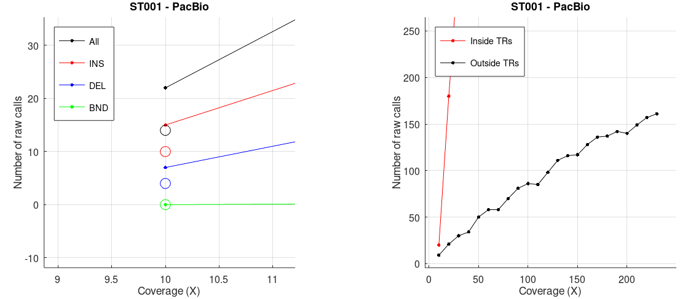

# Effect of coverage on somatic SV calling

[Metadata of all SMaHT samples](https://docs.google.com/spreadsheets/d/11T_QpVq4XEfupEeGD9IW5oVt1our6u3KzEtP6LBEc5w/edit?usp=sharing) at the time of this study.

# Liver, long reads.

We consider the following input:

* `ST001`: healthy liver sample, sequenced at ~230x with PacBio Revio (this includes a ~26x Fiber-seq BAM) and at ~210x with ONT PromethION 24 (coverages estimated from chr1). Data downloaded from [the benchmarking section of the data portal](https://data.smaht.org/data/benchmarking/donor-st001#liver).
* `SMHT001`: death caused by liver failure, alcohol abuse as a death circumstance. Sequenced at ~10x with PacBio Revio. Data downloaded from workspace [SMaHT_Short_Read_Long_Read_Analysis](https://app.terra.bio/#workspaces/smaht-gcc-short-read/SMaHT_Short_Read_Long_Read_Analysis/data), table `SMAHT001_collaborator_long_read`, field `sample_collaborator_id=SMHT001-3I-001A2`.

For each ST001 technology, we merge all the BAMs, we take random samples at multiples of 10x, and on every such subsample we run [`sniffles --mosaic`](https://github.com/fritzsedlazeck/Sniffles#c-mosaic-sv-calling-non-germline-or-somatic-svs) **requiring just two reads** to support a call (i.e. we set `--mosaic-af-min` as a function of coverage). We only output calls that Sniffles considers as somatic, i.e. that have `--mosaic-af-max=0.218` (the default). Each call is annotated with the IDs of the reads that support it. We only consider calls in the standard chromosomes.

Circles: 10x SMHT001 (liver failure). In the 230x ST001 VCF, TR calls do not seem to be enriched in specific TR intervals (according to `bedtools intersect -c`).

Running sniffles with a constant min allele frequency (`--mosaic-af-min 0.05`, the default) shows a peak at 100x instead:

Calls from the BAM with max coverage:

## ST001 PacBio (healthy)
Examples of calls of length >6k in the 230x VCF:

We IGV'd in the 230x BAM each one of the top 50 expressed genes in the liver according to [GTEx](https://www.gtexportal.org/home/tissue/Liver), and we saw a large number of haplotypes in some TRs:

## SMHT001 PacBio (liver failure)
There are only 14 total calls, all of which except one occur in a TR. 

### Potential candidates

### Calls unlikely to be somatic

### Calls near complex events

## Tandem repeat analysis

https://pmc.ncbi.nlm.nih.gov/articles/PMC12339610/

https://trtools.readthedocs.io/en/stable/source/prancSTR.html

https://academic.oup.com/bioinformatics/article/40/8/btae485/7723996

TR and liver: https://research.edgehill.ac.uk/en/publications/length-of-variable-numbers-of-tandem-repeats-in-the-carboxyl-este#:~:text=Length%20of%20Variable%20Numbers%20of%20Tandem%20Repeats,M%C3%B6ssner%2C%20Claudia%20Ruffert%2C%20Mario%20Krehan%2C%20Christian%20Zapf

https://pubmed.ncbi.nlm.nih.gov/40004542/

https://www.mdpi.com/2073-4425/16/2/213

# Liver, short reads.

We consider the following input:

* `ST001`: healthy liver sample, sequenced at ~122x with Illumina NovaSeq X. Data downloaded from [the benchmarking section of the data portal](https://data.smaht.org/data/benchmarking/donor-st001#liver), file accession [SMAFILE7Y4Y9](https://data.smaht.org/output-files/b784cb52-f497-4113-b341-813ee0e6d700/).
* `SMHT001`: cirrotic liver sample sequenced at ~124x with Illumina NovaSeq X. Data downloaded from workspace [SMaHT_Benchmarking_Short_Read](https://app.terra.bio/#workspaces/smaht-gcc-short-read/SMaHT_Benchmarking_Short_Read/data), table `SMAHT001_collaborator_short_read`, field `SMAHT001_collaborator_short_read_id=SM-OLQZF`, fields `collaborator_sample_id=SMHT001-3I-001A1`.

Many short-read somatic callers work in a tumor-normal setting, so we select the following data as "normal":

* `ST001`: a skin sample sequenced at ~100x with Illumina NovaSeq X. Data downloaded from [the benchmarking section of the data portal](https://data.smaht.org/data/benchmarking/donor-st001#skin), file accession [SMAFINU18SZV](https://data.smaht.org/output-files/40ba2ef7-0de0-44d9-992a-189731059bb0/).
* `SMHT001`: a skin sample sequenced at ~90x with Illumina NovaSeq X. Data downloaded from workspace [SMaHT_Benchmarking_Short_Read](https://app.terra.bio/#workspaces/smaht-gcc-short-read/SMaHT_Benchmarking_Short_Read/data), table `SMAHT001_collaborator_short_read`, field `SMAHT001_collaborator_short_read_id=SM-OLRTD`, fields `collaborator_sample_id=SMHT001-3AF-001A2`.

We run [Manta](https://github.com/Illumina/manta?tab=readme-ov-file) in tumor-normal  somatic mode (Manta has also a tumor-only mode, but it is [experimental](https://github.com/Illumina/manta/blob/master/docs/userGuide/README.md#introduction)).

<!--
* [GRIDSS](https://github.com/PapenfussLab/gridss?tab=readme-ov-file) in single-sample mode. This is unlikely to outputs somatic calls, since the [readme suggests](https://github.com/PapenfussLab/gridss?tab=readme-ov-file#how-do-i-perform-tumournormal-somatic-variant-calling) to jointly call on all samples from a patient. We should also run `gridss_somatic_filter` at the end, but this seems to [require](https://github.com/PapenfussLab/gridss?tab=readme-ov-file#how-do-i-create-the-panel-of-normals-required-by-gridss_somatic_filter) a panel of normals since it still assumes a tumor/normal setting. 

Delly seems to [require](https://github.com/dellytools/delly#somatic-sv-calling) matched tumor/normal samples, so we don't run it.
-->

## SMHT001 (liver failure)

We IGV'd each one of the top 50 expressed genes in the liver according to [GTEx](https://www.gtexportal.org/home/tissue/Liver), but we could only find intronic SVs in C1R and HPD that are germline (we checked other tissues from the same donor and they appear there as well).

